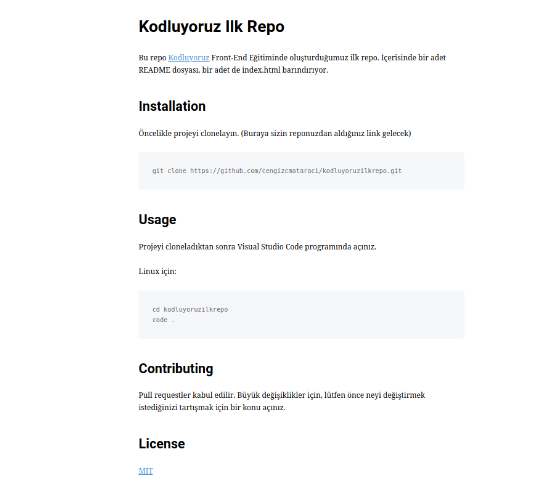

# Kodluyoruz İlk Repo

Bu repo [Kodluyoruz](https://kodluyoruz.org/) Front-End Eğitiminde oluşturduğumuz ilk repo. İçerisinde bir adet README dosyası, bir adet de index.html barındırıyor 


## Installation
``` 
git clone https://github.com/ulukayalperen7/kodluyoruzilkrepo.git`
```

## Usage
Linux için 

```
cd kodluyoruzilkrepo
code.
```

## Contributing
Pull requestler kabul edilir. Büyük bir değişiklik varsa lütfen önce neyi değiştirmek istediğinizi tartışmak için bir konu yazınız.

## Licence
[MIT](https://choosealicense.com/licenses/mit/)